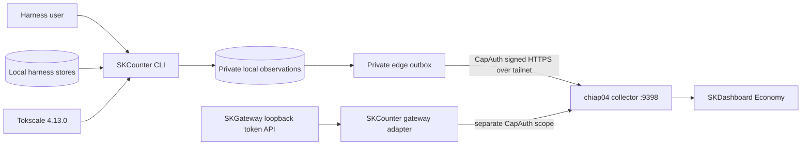
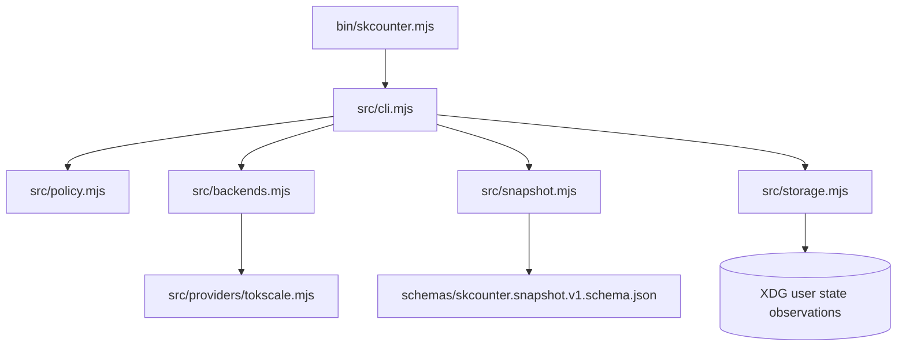
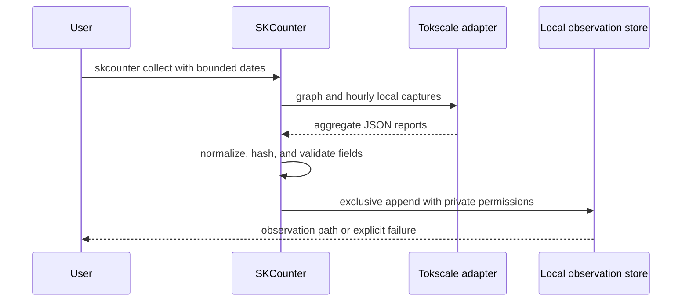
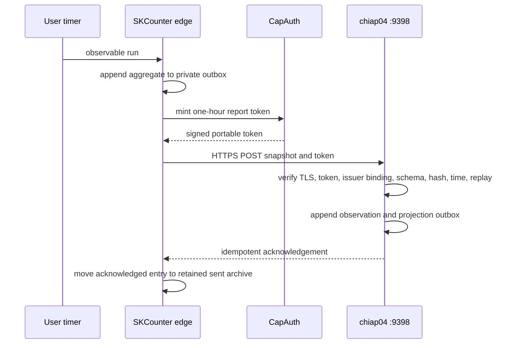

# SKCounter Standard Operating Procedures

Status: release candidate for version 0.2.0.

SKCounter is the governed local AI usage accounting facade for SK fleet harnesses. Harness users call the `skcounter` CLI; SKDashboard consumes only normalized aggregate observations.

## 1. Overview

SKCounter owns the stable command name, local-only policy, backend adapter contract, normalized snapshot schema, local observation storage, and deployment documentation.

Version 0.2.0 explicitly does not own:

- Harness session files or their retention.
- Model routing or inference authorization.
- Provider billing truth or subscription quotas.
- Joule balances or Autopilot settlements.
- SKGateway request accounting internals. SKCounter owns only the privacy-safe `gateway_observed` adapter and projection contract.
- Root-level or cross-user session discovery.

The initial backend is `@tokscale/cli` 4.13.0. Backend replacement occurs behind `src/providers/` without changing fleet callers or the snapshot schema.

## 2. Architecture

### 2.1 System context



### 2.2 Component view



### 2.3 Data flow and protection


The 0.2.0 harness and gateway paths end at the append-only chiap04 collector and its rebuildable projection outbox. SKGateway observations use a distinct identity, capability, and measurement lane and are never combined with harness totals by default.

### 2.4 Collection sequence



### 2.5 Delivery sequence



### Start here

- `bin/skcounter.mjs`: executable entry point.
- `src/cli.mjs`: command dispatch, exit codes, and facade-owned commands.
- `src/policy.mjs`: allowlist, blocked upstream commands, and fail-closed behavior.
- `src/providers/tokscale.mjs`: pinned provider resolution, isolated environment, and execution.
- `src/snapshot.mjs` plus `src/storage.mjs`: normalization, hashing, and private append-only observation writes.

### Data owned

SKCounter owns only normalized observations beneath `${SKCOUNTER_STATE_DIR:-${XDG_STATE_HOME:-$HOME/.local/state}/skcounter}/observations`. It does not own or mutate source harness stores. The local observation root is rebuildable from the authorized local sources while those sources remain available.

### External dependencies and integration points

| Dependency | Direction | Current purpose |
| --- | --- | --- |
| `@tokscale/cli` 4.13.0 | SKCounter calls | Local parsing and aggregate reports |
| Local harness stores | SKCounter reads | User-owned source data |
| SKDashboard | Reads normalized observations | Economy AI Usage projection |
| SKCapstone Fleet | Active | Package, timer, version, result, outbox, and acknowledgement inventory |
| CapAuth | Active | Least-privilege report and gateway capability verification |
| SKGateway | Active on chiap01 | Separate `gateway_observed` aggregate lane |

## 3. Build

### Toolchain

| Requirement | Supported value |
| --- | --- |
| Node.js | 20 or newer |
| npm | Version supplied with supported Node.js |
| Python | 3.11 or newer with CapAuth installed in `~/.skenv` |
| Crypto runtime | GnuPG and OpenSSL 3 |
| Operating system | Linux or WSL for the current installer |
| Runtime privilege | Harness-owning user, never root |

Nodes whose system package is older than Node.js 20 use the checksum-verified user runtime without changing the operating-system package:

```bash
./scripts/install-node-user.sh 22.23.2
node --version
```

### Reproducible local build

```bash
git clone https://github.com/smilinTux/skcounter.git
cd skcounter
npm ci --ignore-scripts
npm run check
```

`npm ci --ignore-scripts` consumes the committed lockfile and prevents dependency install scripts. `npm run check` runs the test suite and package dry run.

### Package inspection

```bash
npm audit --omit=dev
npm pack --dry-run
```

The package is private in npm metadata. Version 0.2.0 is distributed from the repository and installed with the user installer; it is not published to the public npm registry.

## 4. Test

### Required release gate

Run from the repository root:

```bash
npm ci --ignore-scripts
npm test
npm audit --omit=dev
npm run test:package
node --check bin/skcounter.mjs
node --check src/cli.mjs
node --check src/snapshot.mjs
node --check services/collector.mjs
python3 -m py_compile edge/skcounter_edge.py edge/skcounter_schedule.py services/capauth_verify.py
```

Run the sk-standards documentation and CI integrity checks from a sibling `sk-standards` checkout:

```bash
python3 ../sk-standards/scripts/docs_check.py --repo . --tier 1 --tier 2 --tier 3
python3 ../sk-standards/scripts/docs_check.py --self-test
python3 ../sk-standards/scripts/ci_gate_check.py --self-test
python3 ../sk-standards/scripts/ci_gate_check.py audit --repo .
```

The exact relative path may differ by checkout location. CI uses the reusable workflows from `smilinTux/sk-standards` and does not depend on a sibling checkout.

Release is blocked if any unit test, package check, documentation tier, negative control, CI audit, dependency audit, or secret scan is red or skipped.

### Canary checks

```bash
./scripts/install-user.sh
skcounter --version
skcounter doctor
skcounter backend --json
skcounter collect --since 2026-08-22 --until 2026-08-23
```

Verify the observation directory is mode `0700` and the observation file is mode `0600`. Do not print the full live observation into a shared CI log.

## 5. Release / Deploy

### Release prerequisites

1. The coordination card is eligible and claimed.
2. `main` is clean and synchronized with the GitHub default branch.
3. `package.json`, `src/constants.mjs`, `CHANGELOG.md`, and the intended tag agree on the version.
4. Section 4 passes locally.
5. GitHub CI, docs-check, CI gate audit, and secret scan are green.
6. Every release claim maps to a named test or command in this SOP.

### Version and tag procedure

For version 0.2.0:

```bash
git switch main
git pull --ff-only origin main
npm ci --ignore-scripts
npm run check
git tag -a v0.2.0 -m "release: SKCounter v0.2.0"
git push origin main
git push origin v0.2.0
```

Create the GitHub release from the annotated tag only after all tag checks pass. Attach no harness sessions, observations, configuration directories, credentials, or capability material.

### User-level canary deployment

```bash
git fetch --tags origin
git switch --detach v0.2.0
./scripts/install-user.sh
$HOME/.local/bin/skcounter --version
$HOME/.local/bin/skcounter doctor
```

The expected version line is `skcounter 0.2.0 (backend tokscale 4.13.0)`. Discovery lists client names only, never source paths.

### Fleet deployment sequence

Fleet activation follows [docs/ROLLOUT.md](./docs/ROLLOUT.md) and the dependent SKCapstone cards:

1. Qualify the append-only chiap04 collector with synthetic reports.
2. Qualify CapAuth allow, deny, expiry, revocation, replay, malformed, oversize, and outage behavior.
3. Activate one chiap08 user timer under a wrapped observable scheduler.
4. Add chiap04, then one WSL principal.
5. Install the passive package on remaining approved harness-capable nodes.
6. Activate per-user timers only where an approved principal owns a supported harness store.
7. Add SKGateway through the separate `gateway_observed` lane.

The qualified 2026-08-23 deployment completed this sequence on eight native Linux nodes plus `chiwk11` WSL. The gateway adapter runs on `chiap01` against loopback only.

No deployment step may pull raw remote session stores, scan all home directories as root, or combine measurement lanes by default.

### Front-end / Exposure

Front-end / Exposure: Tier 0 direct internal service. The collector binds only to the chiap04 tailnet address `100.84.237.127:9398`. It has no Funnel, public DNS, reverse proxy, or public route. The network surface is `POST /v1/observations`, `GET /healthz`, and `GET /metrics`, all over certificate-verified HTTPS. CapAuth is mandatory for the mutation endpoint.

### Collector deployment on chiap04

```bash
./scripts/install-user.sh
./scripts/install-runtime.sh collector
./scripts/provision-collector-tls.sh 100.84.237.127 "$HOME/.config/skcounter/tls"
systemctl --user daemon-reload
systemctl --user enable --now skcounter-collector.service
curl --fail --cacert "$HOME/.config/skcounter/tls/collector.crt" \
  https://100.84.237.127:9398/healthz
```

Before activation, create `~/.config/skcounter/collector.json` from the schema in section 6, import each edge public certificate into the isolated verifier keyring, and bind each fingerprint to its exact node and principal. Never copy an edge private key to chiap04.

### Edge deployment

```bash
./scripts/install-user.sh
./scripts/install-runtime.sh edge
./scripts/provision-edge-identity.sh \
  "$HOME/.local/state/skcounter/capauth" \
  "$HOME/.local/state/skcounter/capauth-gnupg" \
  "$(hostname)" "$USER" \
  "$HOME/.local/state/skcounter/public.asc"
systemctl --user start skcounter-edge.service
systemctl --user enable --now skcounter-edge.timer
systemctl --user list-timers skcounter-edge.timer
```

Copy only `public.asc` to the collector verifier. The timer's first scheduled run occurs after five minutes. Later runs occur every 15 minutes with up to two minutes of randomized delay.

Register the corresponding Fleet status objects before requiring Fleet publication:

```bash
./scripts/apply-fleet-cronjobs.sh chiap01 chiap02 chiap03
SKCOUNTER_FLEET_JOB=skcounter-gateway ./scripts/apply-fleet-cronjobs.sh chiap01
skcapstone fleet describe cronjob skcounter-edge-chiap01
```

### SKGateway adapter deployment

The gateway adapter runs only as the user that owns the active SKGateway process. Its token source must be loopback HTTP and its collector capability must be exactly `skcounter.gateway.submit`.

```bash
./scripts/install-runtime.sh gateway
./scripts/provision-edge-identity.sh \
  "$HOME/.local/state/skcounter-gateway/capauth" \
  "$HOME/.local/state/skcounter-gateway/gnupg" \
  "chiap01" "skgateway" \
  "$HOME/.local/state/skcounter-gateway/public.asc" \
  "skcounter.gateway.submit"
systemctl --user start skcounter-gateway.service
systemctl --user enable --now skcounter-gateway.timer
```

Import only the public key into the collector verifier and bind its trust entry to node `chiap01`, principal `skgateway`, lane `gateway_observed`, and scope `skcounter.gateway.submit`.

### Rollback

Disable the per-user timer before removing a package:

```bash
systemctl --user disable --now skcounter-edge.timer
systemctl --user disable --now skcounter-edge.service
./scripts/uninstall-user.sh
```

Uninstallation removes the command but preserves configuration and observation state. Preserve unacknowledged observations for investigation unless an approved retention action authorizes removal. Reinstall the prior annotated tag using the same detached-tag canary procedure.

## 6. Configuration / Usage

| Variable | Default | Purpose |
| --- | --- | --- |
| `SKCOUNTER_PREFIX` | `$HOME/.local` | User installation prefix |
| `SKCOUNTER_BACKEND` | `tokscale` | Selected provider adapter |
| `SKCOUNTER_PRINCIPAL_ID` | `$USER` or `$LOGNAME` | Snapshot principal identity |
| `SKCOUNTER_STATE_DIR` | XDG user state | SKCounter state root |
| `XDG_STATE_HOME` | `$HOME/.local/state` | Standard state root fallback |
| `SKCOUNTER_BACKEND_CONFIG_HOME` | `$HOME/.config/skcounter/providers` | Isolated backend configuration |

Runtime configuration is stored in `~/.config/skcounter/collector.json` on chiap04, `~/.config/skcounter/edge.json` on each active harness principal, and `~/.config/skcounter/gateway.json` on the SKGateway host. All files are mode `0600`. The collector config declares `skcounter.collector.config.v1`, the tailnet bind, port `9398`, TLS paths, one MiB limit, 300 second clock skew, four allowed views, CapAuth verifier paths, exact issuer bindings, and retention. Edge configs declare `skcounter.edge.config.v1`, the HTTPS collector URL, pinned collector certificate, local state, exact node and principal, isolated CapAuth keyring, retry limits, measurement lane, and seven-day sent retention.

Tokscale receives `TOKSCALE_API_URL=http://127.0.0.1:9` from the adapter as a second local-only policy layer. Do not override the child environment to restore upstream social reporting.

Collection accepts only `--since YYYY-MM-DD`, `--until YYYY-MM-DD`, and `--output-dir PATH`. The default window covers 30 UTC dates including the current date.

## 7. API / Reference

### Stable facade commands

| Command | Result |
| --- | --- |
| `skcounter models` | Usage grouped by model |
| `skcounter monthly` | Daily usage report |
| `skcounter hourly` | Hourly usage report |
| `skcounter clients` | Detected client names |
| `skcounter graph` | Contribution graph JSON |
| `skcounter time-metrics` | Local activity metrics |
| `skcounter report` | Static report with summarization disabled |
| `skcounter pricing` | Public pricing metadata lookup |
| `skcounter snapshot` | Normalized aggregate JSON on stdout |
| `skcounter collect` | Private append-only local observation |
| `skcounter doctor` | Backend and client discovery state |
| `skcounter backend` | Facade, backend, version, and policy state |
| `skcounter_edge.py status --config PATH` | Last edge result, pending depth, and acknowledgement counts |
| `skcounter_gateway.py status --config PATH` | Last gateway adapter result and private outbox depth |

### Collector endpoints

| Endpoint | Authorization | Contract |
| --- | --- | --- |
| `POST /v1/observations` | Exact CapAuth `skcounter.report.submit` or `skcounter.gateway.submit` binding | Accepts one lane-bound `skcounter.snapshot.v1`; returns `skcounter.ack.v1` |
| `GET /healthz` | Tailnet transport boundary | Health, configured principal count, freshness, and counters |
| `GET /metrics` | Tailnet transport boundary | Prometheus accepted, duplicate, rejected, replayed, invalid, and delayed counters |

The canonical machine contract is [schemas/skcounter.snapshot.v1.schema.json](./schemas/skcounter.snapshot.v1.schema.json). Unknown commands fail closed. Blocked commands exit 2 without invoking the backend.

## 8. Troubleshooting

| Symptom | Check |
| --- | --- |
| `skcounter: command not found` | Run `ls -l "$HOME/.local/bin/skcounter"` and add `$HOME/.local/bin` to `PATH`. |
| Installer rejects Node.js | Run `node --version`; install Node.js 20 or newer. |
| Doctor detects no clients | Run as the same operating-system user that owns the harness store. Do not use root. |
| Backend resolution fails | Run `npm ci --ignore-scripts`, then `skcounter backend --json`. |
| A command exits 2 | Read stderr; the local-only policy denied an upstream or unknown command. |
| Collection exits 1 | Validate dates use `YYYY-MM-DD`, the range is ordered, and the backend can read only the current user's stores. |
| Duplicate observation write fails | The exclusive append protected an existing path. Preserve the existing file and rerun with a new observation time. |
| Estimated cost differs from billing | Treat it as provider-estimated. Check `pricing_revision`; SKCounter does not claim provider billing truth. |
| Dashboard coverage is below 100 percent | Inspect collector freshness and missing nodes. Missing coverage is not zero usage. |
| Gateway and harness totals differ | Compare lanes separately. Do not sum them without an approved correlation rule. |
| Gateway token total is lower than request count suggests | Inspect SKGateway upstream usage capture. Missing provider usage remains missing and is never estimated by this adapter. |
| Edge status has pending records | Check `systemctl --user status skcounter-edge.service`, collector health, TLS certificate validity, CapAuth issuer enablement, and clock synchronization. |
| Collector rejects `issuer_not_trusted` | Import only the edge public certificate, add the exact uppercase fingerprint binding, check node and principal, then restart the collector. |
| No metrics after activation | Start one on-demand edge run and inspect `~/.local/state/skcounter/run-ledger.jsonl`; normal scheduled visibility is within 17 minutes. |

## 9. Maturity-tier + Version reference

| Field | Value |
| --- | --- |
| Maturity tier | T0 - Classical |
| Version lifecycle | Incubating, pre-1.0 |
| Current SemVer | 0.2.0 |
| Initial backend | Tokscale 4.13.0 |
| Snapshot contract | `skcounter.snapshot.v1` |
| Network exposure | Tailnet-only HTTPS on chiap04 `100.84.237.127:9398` |

SKCounter follows the SK Cryptography Standard's honest-claim requirements on the surfaces in [docs/crypto-architecture.md](./docs/crypto-architecture.md). Version 0.2.0 is classical T0 and does not claim T1 crypto agility or post-quantum protection.

**Service units:** the collector uses Tier B backoff and a start limiter; the edge worker is a bounded one-shot unit. This conforms to the SK Service Unit Standard.

**Observability and Scheduling:** every timer run records a private ledger, preserves the wrapped exit status, emits a critical alert, and creates a deduplicated GTD item on failure. This conforms to the SK Observability and Scheduling Standard, with the temporary GTD source-enum limitation recorded in README.

<!-- docs-evidence
verified: 2026-08-23
checks:
  - name: documented executable entry point exists
    run: test -x bin/skcounter.mjs
  - name: Tokscale backend remains pinned to 4.13.0
    run: grep -q '"@tokscale/cli": "4.13.0"' package.json
  - name: snapshot v1 schema remains the canonical contract
    run: grep -q '"const": "skcounter.snapshot.v1"' schemas/skcounter.snapshot.v1.schema.json
  - name: user install and rollback entry points exist
    run: test -x scripts/install-user.sh && test -x scripts/uninstall-user.sh
  - name: collector, edge, and gateway units exist
    run: test -f deploy/systemd/skcounter-collector.service && test -f deploy/systemd/skcounter-edge.timer && test -f deploy/systemd/skcounter-gateway.timer
  - name: network mutation requires CapAuth
    run: grep -q 'CapAuth ' services/collector.mjs
-->
