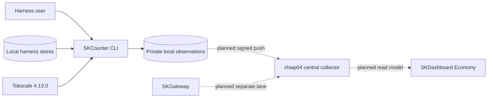
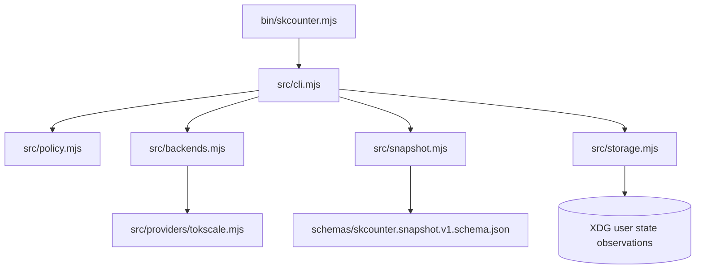
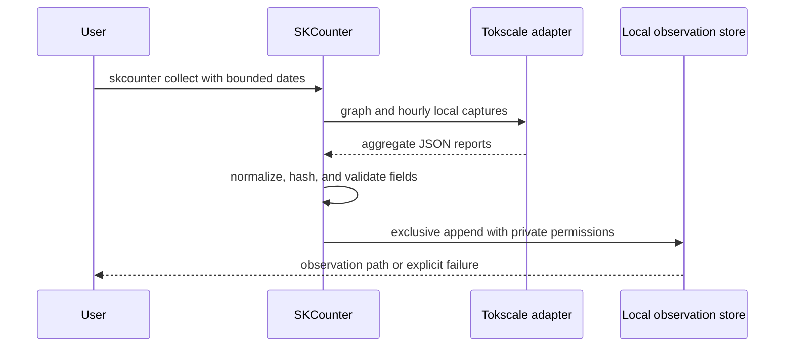

# SKCounter Standard Operating Procedures

Status: release candidate for version 0.1.0.

SKCounter is the governed local AI usage accounting facade for SK fleet harnesses. Harness users call the `skcounter` CLI; SKDashboard consumes only normalized aggregate observations.

## 1. Overview

SKCounter owns the stable command name, local-only policy, backend adapter contract, normalized snapshot schema, local observation storage, and deployment documentation.

Version 0.1.0 explicitly does not own:

- Harness session files or their retention.
- Model routing or inference authorization.
- Provider billing truth or subscription quotas.
- Joule balances or Autopilot settlements.
- A network collector, CapAuth report capability, fleet timer, or SKGateway adapter.
- Root-level or cross-user session discovery.

The initial backend is `@tokscale/cli` 4.13.0. Backend replacement occurs behind `src/providers/` without changing fleet callers or the snapshot schema.

## 2. Architecture

### 2.1 System context



### 2.2 Component view



### 2.3 Data flow and protection

```mermaid
flowchart LR
    Raw["Harness sessions<br/>sensitive, local user storage"]
      -->|"local read as owning user<br/>no network transform"| Scan["Pinned backend<br/>same user process"]
    Scan
      -->|"normalize and remove raw content,<br/>paths, credentials, identifiers"| Aggregate["skcounter.snapshot.v1<br/>internal aggregate"]
    Aggregate
      -->|"append only, mode 0600<br/>directory mode 0700"| Outbox[("Local observation store")]
    Outbox
      -. "planned TLS tailnet push<br/>CapAuth report capability" .-> Central[("chiap04 observations<br/>append only")]
    Central
      -. "read-only aggregate projection" .-> UI["SKDashboard Economy<br/>internal operator view"]
```



The current 0.1.0 path ends at the local observation store. Dashed network hops are approved architecture, not deployed behavior.

### 2.4 Collection sequence



### Start here

- `bin/skcounter.mjs`: executable entry point.
- `src/cli.mjs`: command dispatch, exit codes, and facade-owned commands.
- `src/policy.mjs`: allowlist, blocked upstream commands, and fail-closed behavior.
- `src/providers/tokscale.mjs`: pinned provider resolution, isolated environment, and execution.
- `src/snapshot.mjs` plus `src/storage.mjs`: normalization, hashing, and private append-only observation writes.

### Data owned

SKCounter owns only normalized observations beneath `${SKCOUNTER_STATE_DIR:-${XDG_STATE_HOME:-$HOME/.local/state}/skcounter}/observations`. It does not own or mutate source harness stores. The local observation root is rebuildable from the authorized local sources while those sources remain available.

### External dependencies and integration points

| Dependency | Direction | Current purpose |
| --- | --- | --- |
| `@tokscale/cli` 4.13.0 | SKCounter calls | Local parsing and aggregate reports |
| Local harness stores | SKCounter reads | User-owned source data |
| SKDashboard | Reads normalized observations | Economy AI Usage projection |
| SKCapstone Fleet | Planned | Package, timer, version, and health inventory |
| CapAuth | Planned | Least-privilege report capability verification |
| SKGateway | Planned | Separate `gateway_observed` aggregate lane |

## 3. Build

### Toolchain

| Requirement | Supported value |
| --- | --- |
| Node.js | 20 or newer |
| npm | Version supplied with supported Node.js |
| Operating system | Linux or WSL for the current installer |
| Runtime privilege | Harness-owning user, never root |

### Reproducible local build

```bash
git clone https://github.com/smilinTux/skcounter.git
cd skcounter
npm ci --ignore-scripts
npm run check
```

`npm ci --ignore-scripts` consumes the committed lockfile and prevents dependency install scripts. `npm run check` runs the test suite and package dry run.

### Package inspection

```bash
npm audit --omit=dev
npm pack --dry-run
```

The package is private in npm metadata. Version 0.1.0 is distributed from the repository and installed with the user installer; it is not published to the public npm registry.

## 4. Test

### Required release gate

Run from the repository root:

```bash
npm ci --ignore-scripts
npm test
npm audit --omit=dev
npm run test:package
node --check bin/skcounter.mjs
node --check src/cli.mjs
node --check src/snapshot.mjs
```

Run the sk-standards documentation and CI integrity checks from a sibling `sk-standards` checkout:

```bash
python3 ../sk-standards/scripts/docs_check.py --repo . --tier 1 --tier 2 --tier 3
python3 ../sk-standards/scripts/docs_check.py --self-test
python3 ../sk-standards/scripts/ci_gate_check.py --self-test
python3 ../sk-standards/scripts/ci_gate_check.py audit --repo .
```

The exact relative path may differ by checkout location. CI uses the reusable workflows from `smilinTux/sk-standards` and does not depend on a sibling checkout.

Release is blocked if any unit test, package check, documentation tier, negative control, CI audit, dependency audit, or secret scan is red or skipped.

### Canary checks

```bash
./scripts/install-user.sh
skcounter --version
skcounter doctor
skcounter backend --json
skcounter collect --since 2026-08-22 --until 2026-08-23
```

Verify the observation directory is mode `0700` and the observation file is mode `0600`. Do not print the full live observation into a shared CI log.

## 5. Release / Deploy

### Release prerequisites

1. The coordination card is eligible and claimed.
2. `main` is clean and synchronized with the GitHub default branch.
3. `package.json`, `src/constants.mjs`, `CHANGELOG.md`, and the intended tag agree on the version.
4. Section 4 passes locally.
5. GitHub CI, docs-check, CI gate audit, and secret scan are green.
6. Every release claim maps to a named test or command in this SOP.

### Version and tag procedure

For version 0.1.0:

```bash
git switch main
git pull --ff-only origin main
npm ci --ignore-scripts
npm run check
git tag -a v0.1.0 -m "release: SKCounter v0.1.0"
git push origin main
git push origin v0.1.0
```

Create the GitHub release from the annotated tag only after all tag checks pass. Attach no harness sessions, observations, configuration directories, credentials, or capability material.

### User-level canary deployment

```bash
git fetch --tags origin
git switch --detach v0.1.0
./scripts/install-user.sh
$HOME/.local/bin/skcounter --version
$HOME/.local/bin/skcounter doctor
```

The expected version line is `skcounter 0.1.0 (backend tokscale 4.13.0)`. Discovery lists client names only, never source paths.

### Fleet deployment sequence

Fleet activation is not authorized by the v0.1.0 tag alone. Follow [docs/ROLLOUT.md](./docs/ROLLOUT.md) and the dependent SKCapstone cards:

1. Qualify the append-only chiap04 collector with synthetic reports.
2. Qualify CapAuth allow, deny, expiry, revocation, replay, malformed, oversize, and outage behavior.
3. Activate one chiap08 user timer under a wrapped observable scheduler.
4. Add chiap04, then one WSL principal.
5. Install the passive package on remaining approved harness-capable nodes.
6. Activate per-user timers only where an approved principal owns a supported harness store.
7. Add SKGateway through the separate `gateway_observed` lane.

No deployment step may pull raw remote session stores, scan all home directories as root, or combine measurement lanes by default.

### Front-end / Exposure

Front-end / Exposure: N/A for version 0.1.0 because SKCounter is a local CLI and ships no listener or public route.

The planned central collector is tailnet-only and separate from SKGateway. Its exact bind address, TLS identity, CapAuth policy, health endpoint, and service unit must be approved and documented by the central collector task before activation.

### Rollback

Disable any future per-user timer before removing a package. Version 0.1.0 installs no timer, so local rollback is:

```bash
./scripts/uninstall-user.sh
```

Uninstallation removes the command but preserves configuration and observation state. Preserve unacknowledged observations for investigation unless an approved retention action authorizes removal. Reinstall the prior annotated tag using the same detached-tag canary procedure.

## 6. Configuration / Usage

| Variable | Default | Purpose |
| --- | --- | --- |
| `SKCOUNTER_PREFIX` | `$HOME/.local` | User installation prefix |
| `SKCOUNTER_BACKEND` | `tokscale` | Selected provider adapter |
| `SKCOUNTER_PRINCIPAL_ID` | `$USER` or `$LOGNAME` | Snapshot principal identity |
| `SKCOUNTER_STATE_DIR` | XDG user state | SKCounter state root |
| `XDG_STATE_HOME` | `$HOME/.local/state` | Standard state root fallback |
| `SKCOUNTER_BACKEND_CONFIG_HOME` | `$HOME/.config/skcounter/providers` | Isolated backend configuration |

Tokscale receives `TOKSCALE_API_URL=http://127.0.0.1:9` from the adapter as a second local-only policy layer. Do not override the child environment to restore upstream social reporting.

Collection accepts only `--since YYYY-MM-DD`, `--until YYYY-MM-DD`, and `--output-dir PATH`. The default window covers 30 UTC dates including the current date.

## 7. API / Reference

### Stable facade commands

| Command | Result |
| --- | --- |
| `skcounter models` | Usage grouped by model |
| `skcounter monthly` | Daily usage report |
| `skcounter hourly` | Hourly usage report |
| `skcounter clients` | Detected client names |
| `skcounter graph` | Contribution graph JSON |
| `skcounter time-metrics` | Local activity metrics |
| `skcounter report` | Static report with summarization disabled |
| `skcounter pricing` | Public pricing metadata lookup |
| `skcounter snapshot` | Normalized aggregate JSON on stdout |
| `skcounter collect` | Private append-only local observation |
| `skcounter doctor` | Backend and client discovery state |
| `skcounter backend` | Facade, backend, version, and policy state |

The canonical machine contract is [schemas/skcounter.snapshot.v1.schema.json](./schemas/skcounter.snapshot.v1.schema.json). Unknown commands fail closed. Blocked commands exit 2 without invoking the backend.

## 8. Troubleshooting

| Symptom | Check |
| --- | --- |
| `skcounter: command not found` | Run `ls -l "$HOME/.local/bin/skcounter"` and add `$HOME/.local/bin` to `PATH`. |
| Installer rejects Node.js | Run `node --version`; install Node.js 20 or newer. |
| Doctor detects no clients | Run as the same operating-system user that owns the harness store. Do not use root. |
| Backend resolution fails | Run `npm ci --ignore-scripts`, then `skcounter backend --json`. |
| A command exits 2 | Read stderr; the local-only policy denied an upstream or unknown command. |
| Collection exits 1 | Validate dates use `YYYY-MM-DD`, the range is ordered, and the backend can read only the current user's stores. |
| Duplicate observation write fails | The exclusive append protected an existing path. Preserve the existing file and rerun with a new observation time. |
| Estimated cost differs from billing | Treat it as provider-estimated. Check `pricing_revision`; SKCounter does not claim provider billing truth. |
| Dashboard coverage is below 100 percent | Inspect collector freshness and missing nodes. Missing coverage is not zero usage. |
| Gateway and harness totals differ | Compare lanes separately. Do not sum them without an approved correlation rule. |

## 9. Maturity-tier + Version reference

| Field | Value |
| --- | --- |
| Maturity tier | T0 - N/A, no key material |
| Version lifecycle | Incubating, pre-1.0 |
| Current SemVer | 0.1.0 |
| Initial backend | Tokscale 4.13.0 |
| Snapshot contract | `skcounter.snapshot.v1` |
| Network exposure | None in version 0.1.0 |

SKCounter is not a cryptographic component. It creates SHA-256 content digests but generates, exchanges, signs, verifies, wraps, and stores no key material. Future CapAuth signing and verification belongs to the separately reviewed collector path.

<!-- docs-evidence
verified: 2026-08-23
checks:
  - name: documented executable entry point exists
    run: test -x bin/skcounter.mjs
  - name: Tokscale backend remains pinned to 4.13.0
    run: grep -q '"@tokscale/cli": "4.13.0"' package.json
  - name: snapshot v1 schema remains the canonical contract
    run: grep -q '"const": "skcounter.snapshot.v1"' schemas/skcounter.snapshot.v1.schema.json
  - name: user install and rollback entry points exist
    run: test -x scripts/install-user.sh && test -x scripts/uninstall-user.sh
  - name: version 0.1.0 ships no systemd unit
    run: test ! -d systemd
-->
